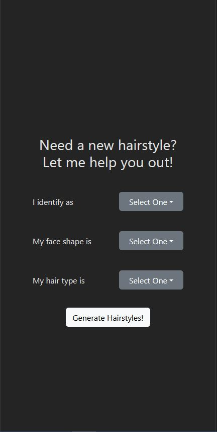
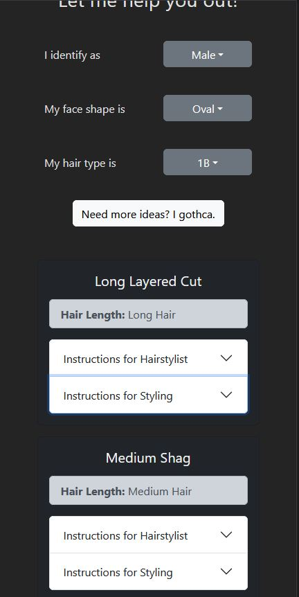
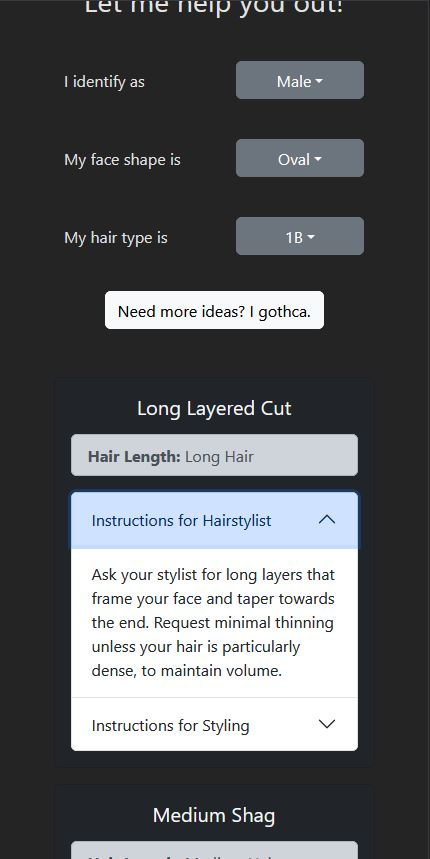

# Haircut App

A web application to help people get recommendations on a new hairstyle depending on their face shape and hair type.

## Reasoning

I've always been experimental with my own hair. Whenever I'm looking for a new hairstyle, I would go on the internet and just scroll to picture after picture looking for something I wanted to try. I created this web app to help me out with that. 

This project also gave me a reason to learn Go and to use OpenAPI's API. 

## What I Learned

This was the first ever time I used Go. By doing this, I learned the basic syntax and creating request handlers for the server. I think the concept that confused me the most was the idea of struct tags.

In addition, this was the first time I used an organization's API. This has taught me the importance of documentation and how useful it is. At the time of creating this project, Structed Outputs were just introduced to this API, so there were not many example out there to see how it worked. Thankfully, the API documentation was just enough to get my implementation to work. 

## Screenshots

## Technologies Used
- React.js
- SASS
- Typescript
- React Bootstrap
- GO
